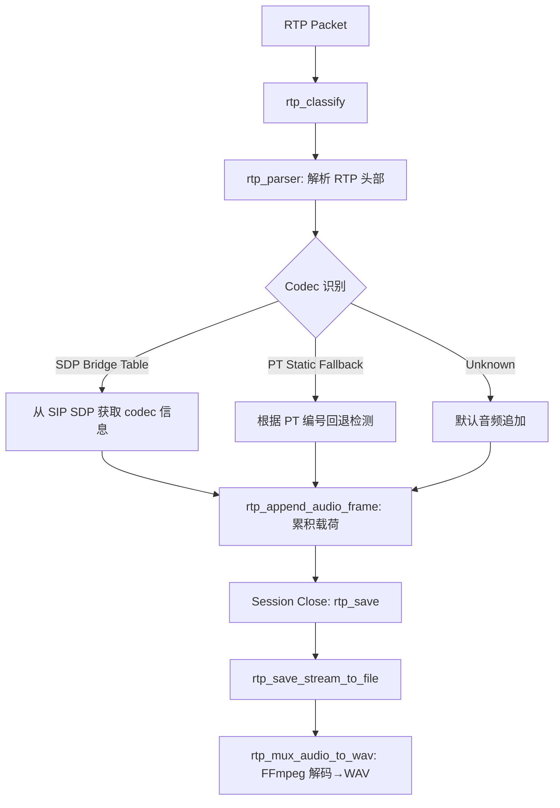

# G.721 / G.726-32 音频解码还原方案

## 背景

测试文件 [`/data/pcap/sip_birthday_g721.pcap`](/data/pcap/sip_birthday_g721.pcap) 中包含 SIP/RTP 会话，使用 **G.721** 编解码器编码的音频流。当前 Arkime RTP 解析器支持 PCMU、PCMA、G722、G729、OPUS 等音频编解码器的解码还原，但**缺少 G.721 支持**。

## G.721 编解码器概述

| 属性 | 值 |
|------|------|
| 标准 | ITU-T G.721 (32 kbps ADPCM) |
| 采样率 | 8000 Hz |
| 比特率 | 32 kbps |
| 比特/样本 | 4 bits/sample |
| RTP 时钟频率 | 8000 Hz |
| RFC 3551 静态 PT | 2 (G.721) |
| SDP 名称 | `G726-32`（动态 PT 常见别名，等同于 G.721 32kbps） |
| FFmpeg CodecID | `AV_CODEC_ID_ADPCM_G726`（**FFmpeg 6.1.1 已将 G721 合并入 G726 多速率解码器**） |
| 帧大小 (20ms @ 8kHz) | 80 字节 (160 samples × 4 bits = 80 bytes) |
| 解码器关键参数 | `bits_per_coded_sample = 4`（选择 G.726 32kbps 模式） |
| 声道 | 单声道 Mono |

> **重要**: FFmpeg 6.1.1 中 `AV_CODEC_ID_ADPCM_G721` 不存在，已被合并到 `AV_CODEC_ID_ADPCM_G726`。G.726 是多码率解码器（16/24/32/40 kbps），需要设置 `bits_per_coded_sample=4` 选择 32kbps (=G.721) 模式。

## RTP 解析流程 (现有架构)



## 实测发现

### 1. FFmpeg 6.1.1 无 `AV_CODEC_ID_ADPCM_G721`

系统中 FFmpeg 版本为 6.1.1，`AV_CODEC_ID_ADPCM_G721` 不存在。G.721 已被合并到 `AV_CODEC_ID_ADPCM_G726`（多码率解码器）。

**验证命令**：
```bash
ffmpeg -decoders 2>/dev/null | grep g726
# 输出: adpcm_g726 (解码器存在)
# 无 adpcm_g721
```

### 2. 需要 `bits_per_coded_sample=4`

G.726 解码器支持 16/24/32/40 kbps 四种模式。32kbps 模式（=G.721）需要通过 `dec_ctx->bits_per_coded_sample = 4` 选择。

### 3. 测试 pcap 使用 `G726-32`（非 PT=2）

测试文件 [`/data/pcap/sip_birthday_g721.pcap`](/data/pcap/sip_birthday_g721.pcap) 中使用动态 PT=96，SDP `a=rtpmap:96 G726-32/8000`。编解码器名称为 `G726-32`，需要额外添加别名映射。

### 4. 实际 SDP 协商流程

```
SIP INVITE → SDP body 解析 → rtp_bridge_add(ip, port, codec="G726-32", media="audio")
  → RTP packet → rtp_bridge_lookup → codec="G726-32"
  → rtp_save_stream_to_file(codec="G726-32") → rtp_mux_audio_to_wav("G726-32")
  → AV_CODEC_ID_ADPCM_G726 with bits_per_coded_sample=4 → PCM S16LE WAV
```

## 修改文件清单

| 文件 | 函数/位置 | 修改内容 |
|------|-----------|----------|
| [`capture/parsers/rtp.c`](/data/arkime/capture/parsers/rtp.c) | `rtp_codec_to_avcodec_id()` | 添加 G721/G726-32 → `AV_CODEC_ID_ADPCM_G726` |
| [`capture/parsers/rtp.c`](/data/arkime/capture/parsers/rtp.c) | `rtp_codec_clock_rate()` | 添加 G721/G726-32 → 8000 Hz |
| [`capture/parsers/rtp.c`](/data/arkime/capture/parsers/rtp.c) | `rtp_codec_container_ext()` | 添加 G721/G726-32 → "wav" |
| [`capture/parsers/rtp.c`](/data/arkime/capture/parsers/rtp.c) | `rtp_static_codec_from_pt()` | 添加 PT=2 → "G721" |
| [`capture/parsers/rtp.c`](/data/arkime/capture/parsers/rtp.c) | `rtp_mux_audio_to_wav()` codec selection | 添加 G721/G726-32 → `ADPCM_G726`, 8000Hz |
| [`capture/parsers/rtp.c`](/data/arkime/capture/parsers/rtp.c) | `rtp_mux_audio_to_wav()` decoder ctx | 设置 `bits_per_coded_sample=4` |
| [`capture/parsers/rtp.c`](/data/arkime/capture/parsers/rtp.c) | `rtp_mux_audio_to_wav()` frame_size | 80 bytes (20ms) |
| [`capture/parsers/rtp.c`](/data/arkime/capture/parsers/rtp.c) | `rtp_save_stream_to_file()` | 添加 G721/G726-32 → WAV 路由 |
| [`capture/parsers/sip.c`](/data/arkime/capture/parsers/sip.c) | `sdp_static_codec()` | 添加 PT=2 → "G721" |

## 详细修改计划

### 1. [`capture/parsers/rtp.c`](/data/arkime/capture/parsers/rtp.c)

#### 1.1 [`rtp_codec_to_avcodec_id()`](/data/arkime/capture/parsers/rtp.c:59) — 添加 G.721/G726-32 CodecID 映射

```c
if (g_ascii_strcasecmp(codec, "G721") == 0 ||
    g_ascii_strcasecmp(codec, "G726-32") == 0)  return AV_CODEC_ID_ADPCM_G726;
```

> **注意**: 使用 `AV_CODEC_ID_ADPCM_G726`（非 `ADPCM_G721`），FFmpeg 6.1.1 中此 ID 不存在。

#### 1.2 [`rtp_codec_clock_rate()`](/data/arkime/capture/parsers/rtp.c:75) — 添加 G.721/G726-32 时钟频率

```c
if (g_ascii_strcasecmp(codec, "G729") == 0 ||
    g_ascii_strcasecmp(codec, "G721") == 0 ||
    g_ascii_strcasecmp(codec, "G726-32") == 0) return 8000;
```

#### 1.3 [`rtp_codec_container_ext()`](/data/arkime/capture/parsers/rtp.c:89) — 添加 G.721/G726-32 文件扩展名

```c
if (g_ascii_strcasecmp(codec, "G721") == 0 ||
    g_ascii_strcasecmp(codec, "G726-32") == 0)  return "wav";
```

#### 1.4 [`rtp_static_codec_from_pt()`](/data/arkime/capture/parsers/rtp.c:107) — 添加 PT=2 映射

RFC 3551 中 PT=2 分配为 G.721：

```c
case 2:  return "G721";
```

> 注意：PT=2 在原 `rtp_static_codec_from_pt()` 和 SIP 的 `sdp_static_codec()` 中均缺失，需要同时补充。

#### 1.5 [`rtp_mux_audio_to_wav()`](/data/arkime/capture/parsers/rtp.c:1182) — 添加 G.721/G726-32 解码逻辑

在 G729 分支之后添加 G721/G726-32 分支：

```c
} else if (g_ascii_strcasecmp(codec_name, "G721") == 0 ||
           g_ascii_strcasecmp(codec_name, "G726-32") == 0) {
    codec_id = AV_CODEC_ID_ADPCM_G726;
    sample_rate = 8000;
}
```

**帧大小逻辑** — 在 G729 分支之后添加：

```c
} else if (codec_id == AV_CODEC_ID_ADPCM_G726) {
    frame_size = 80;   /* 20ms @ 8kHz, 4 bits/sample = 80 bytes */
```

> **注意**: 使用 `ADPCM_G726`（非 `ADPCM_G721`），与 FFmpeg 6.1.1 一致。

#### 1.6 解码器上下文参数 — [`bits_per_coded_sample`](/data/arkime/capture/parsers/rtp.c:1229)

G.726 是多速率解码器（16/24/32/40 kbps），需要设置 `bits_per_coded_sample=4` 选择 32kbps 模式：

```c
/* G.726 解码器是多码率（16/24/32/40 kbps），通过 bits_per_coded_sample 选择模式
 * G.721 对应 32kbps = 4 bits/sample */
if (codec_id == AV_CODEC_ID_ADPCM_G726) {
    dec_ctx->bits_per_coded_sample = 4;
}
```

#### 1.7 [`rtp_save_stream_to_file()`](/data/arkime/capture/parsers/rtp.c:1487) — 添加 G.721/G726-32 路由

```c
} else if (g_ascii_strcasecmp(codec, "PCMU") == 0 ||
           g_ascii_strcasecmp(codec, "PCMA") == 0 ||
           g_ascii_strcasecmp(codec, "G722") == 0 ||
           g_ascii_strcasecmp(codec, "G729") == 0 ||
           g_ascii_strcasecmp(codec, "G721") == 0 ||
           g_ascii_strcasecmp(codec, "G726-32") == 0) {
    return rtp_mux_audio_to_wav(output_path, codec, ...);
```

### 2. [`capture/parsers/sip.c`](/data/arkime/capture/parsers/sip.c)

#### 2.1 [`sdp_static_codec()`](/data/arkime/capture/parsers/sip.c:36) — 添加 PT=2 → G721 映射

```c
case 2:  return "G721";
```

## 测试验证步骤

### 编译
```bash
cd /data/arkime
make -C capture/parsers rtp.so sip.so
cp capture/parsers/rtp.so /opt/arkime/parsers/rtp.so
cp capture/parsers/sip.so /opt/arkime/parsers/sip.so
```

### 使用 capture dryrun 测试
```bash
cd /data/arkime
./capture/capture -r /data/pcap/sip_birthday_g721.pcap --dryrun --debug 2>&1 | grep -E "rtp: saving|rtp_mux_audio|audio_to_wav"
```

### 验证输出 WAV 文件
```bash
ffprobe /data/file/ssrc_f0f0f0f0_G726-32.wav 2>&1
```

### 预期输出
- WAV 格式: PCM S16LE, 8000 Hz, 单声道
- 时长: ~21.5 秒
- 文件大小: ~344 KB

## 注意事项

1. **FFmpeg 版本兼容性**：FFmpeg 6.x 已将 G.721 合并到 G.726 解码器，必须使用 `AV_CODEC_ID_ADPCM_G726` + `bits_per_coded_sample=4`
2. **编解码器名称别名**：SDP 中常见的 G.721 名称有 `G721`、`G726-32`、`G726/8000` 等，测试 pcap 使用 `G726-32`
3. **G.721 与 G.726 的区别**：G.721 = 32kbps 固定速率（已废弃），G.726 = 16/24/32/40kbps 可选（取代 G.721）
4. **RTP 静态 PT=2 vs 动态 PT**：RFC 3551 分配 PT=2 给 G.721，但实际网络中更多使用动态 PT（如 PT=96）配合 SDP `a=rtpmap`，本实现同时支持两种方式
5. **原始数据回退**：如果 FFmpeg 解码器不可用，现代码的 `else` 分支会将原始 G.721 编码数据写入 `.raw` 文件
6. **PT=2 映射同时存在于 rtp.c 和 sip.c**：`rtp_static_codec_from_pt()` 用于 RTP 无 SDP 回退，`sdp_static_codec()` 用于 SIP/SDP 静态 PT 处理
