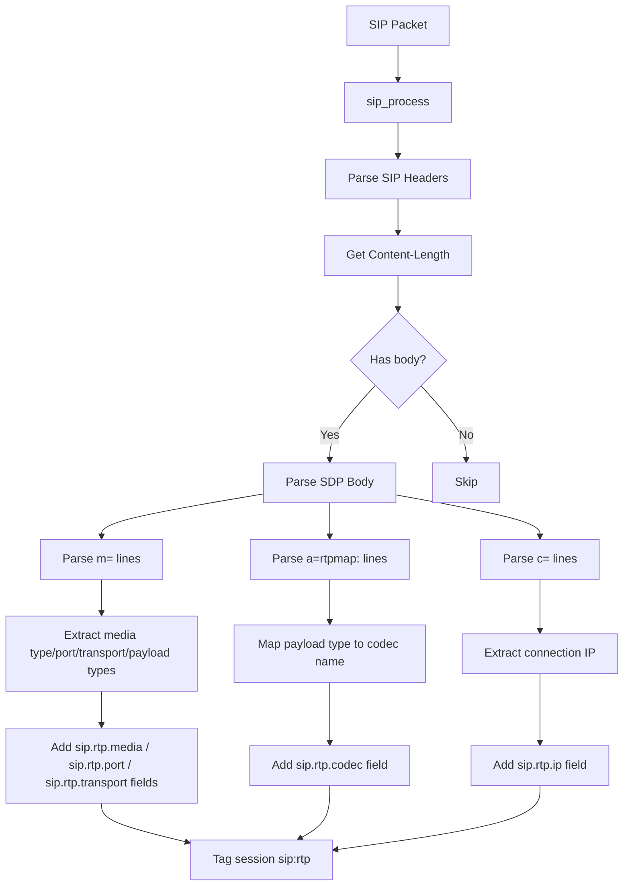

# SIP 协议解析中添加 RTP 流识别与音视频编码信息记录方案

## 背景

SIP（Session Initiation Protocol）通过 SDP（Session Description Protocol）在 INVITE、200 OK 等消息的 body 中协商媒体流。每个 SDP body 包含：

- `m=` 行：定义媒体类型（audio/video）、端口、传输协议（RTP/AVP）和 payload 类型编号
- `a=rtpmap:` 行：将 payload 类型编号映射到具体编解码器名称（如 PCMU、H264、Opus）
- `c=` 行：连接信息，包含 IP 地址
- `a=fmtp:` 行：可选的格式参数

## 当前 SIP 解析器分析

当前 [`capture/parsers/sip.c`](capture/parsers/sip.c) 解析器：

1. 成功解析 SIP 请求行和响应行
2. 解析主要 SIP 头部（Call-ID、From、To、User-Agent、Via、Contact 等）
3. 支持 UDP 和 TCP 传输
4. 通过 `sip_process()` 函数处理 SIP 消息并返回 Content-Length
5. **但 body 内容被完全忽略**，未解析 SDP

## 设计方案

### 架构图



### 修改文件清单

| 文件 | 操作 | 说明 |
|------|------|------|
| [`capture/parsers/sip.c`](capture/parsers/sip.c) | 修改 | 添加 SDP 解析逻辑和新字段定义 |
| [`capture/parsers/sip.detail.jade`](capture/parsers/sip.detail.jade) | 修改 | 添加 RTP 字段显示 |
| [`capture/parsers/type.json`](capture/parsers/type.json) | 修改 | 添加新字段的定义 |

### 详细实现步骤

#### 步骤 1: 在 [`sip.c`](capture/parsers/sip.c) 中添加新字段定义

在现有字段定义之后，添加新的 RTP/媒体相关字段：

```c
// RTP stream fields
LOCAL int rtpMediaField;      // sip.rtp.media - audio, video, etc.
LOCAL int rtpPortField;       // sip.rtp.port - RTP port numbers
LOCAL int rtpCodecField;      // sip.rtp.codec - codec names (PCMU, H264, etc.)
LOCAL int rtpTransportField;  // sip.rtp.transport - RTP/AVP, RTP/SAVP, etc.
LOCAL int rtpIpField;         // sip.rtp.ip - RTP destination IP from SDP
```

#### 步骤 2: 实现 SDP 解析函数

添加以下函数来处理 SDP body 内容：

**`sdp_parse_rtpmap()`** - 解析 `a=rtpmap:` 行

```
输入: "a=rtpmap:0 PCMU/8000"
输出: codec_name = "PCMU"
行为: 查找 "a=rtpmap:" 前缀，跳过 payload type 编号和空格，提取到 '/' 前的编解码器名称
```

**`sdp_parse_media()`** - 解析 `m=` 行

```
输入: "m=audio 49170 RTP/AVP 0 8 101"
输出: media_type="audio", port=49170, transport="RTP/AVP", payloads=[0,8,101]
行为: 按空格分割 m= 行，提取各字段
```

**`sdp_parse_connection()`** - 解析 `c=` 行

```
输入: "c=IN IP4 192.168.1.100"
输出: ip="192.168.1.100"
行为: 跳过 "c=IN IP4 " 或 "c=IN IP6 " 前缀
```

**`sip_parse_sdp_body()`** - 主 SDP 解析入口函数

遍历 SDP body 的每一行（以 CRLF 或 LF 分隔），对每一行：
- 如果以 `m=` 开头 → 调用 `sdp_parse_media()`，存储媒体信息
- 如果是 `a=rtpmap:` → 调用 `sdp_parse_rtpmap()`，映射 codec
- 如果以 `c=` 开头 → 调用 `sdp_parse_connection()`，存储 IP
- 维护一个 `current_pt_to_codec` 映射表（本地数组，在 SDP 会话内有效）

检查 payload type 是否为动态（>=96），如果是则使用 rtpmap 的映射，否则使用内置的静态 payload type 映射表（RFC 3551）。

**静态 Payload Type 映射表**（RFC 3551）：

| PT | Codec Name | Media Type |
|----|-----------|------------|
| 0  | PCMU      | audio      |
| 3  | GSM       | audio      |
| 4  | G723      | audio      |
| 5  | DVI4      | audio      |
| 6  | DVI4      | audio      |
| 7  | LPC       | audio      |
| 8  | PCMA      | audio      |
| 9  | G722      | audio      |
| 10 | L16       | audio      |
| 11 | L16       | audio      |
| 12 | QCELP     | audio      |
| 13 | CN        | audio      |
| 14 | MPA       | audio      |
| 15 | G728      | audio      |
| 16 | DVI4      | audio      |
| 17 | DVI4      | audio      |
| 18 | G729      | audio      |
| 26 | MJPG      | video      |
| 28 | BV16      | audio      |
| 31 | H261      | video      |
| 32 | MPV       | video      |
| 34 | H263      | video      |
| 96-127 | 动态  | 从 rtpmap 获取 |

#### 步骤 3: 修改 `sip_process()` 访问 Body 内容

当前 `sip_process()` 解析头部后返回 Content-Length。需要修改 UDP 和 TCP 解析路径来获取 body 内容。

**UDP 路径（[`sip_udp_parser()`](capture/parsers/sip.c:293)）：**

完整 SIP 消息（headers + body）在一个 UDP 载荷中。修改为：
1. 调用 `sip_process()` 获取 content-length 和头部结束偏移
2. 计算 body 起始位置 = headers 结束位置（空行后）
3. 验证 body 长度 >= content-length
4. 将 body 数据传给 SDP 解析函数

**TCP 路径（[`sip_tcp_parser()`](capture/parsers/sip.c:301)）：**

TCP 下 SIP 消息可能分片，但已有 `ArkimeParserBuf_t` 管理缓存：
1. `sip_process()` 处理完后，body 数据在 `sip->buf[which]` 中
2. 在跳过 body 之前，将 body 内容传给 SDP 解析函数
3. 使用 `arkime_parser_buf_skip()` 跳过 body 的正常逻辑保持不变

#### 步骤 4: 修改 `sip_process()` 函数签名

当前签名：
```c
LOCAL int sip_process(ArkimeSession_t *session, const uint8_t *data, int len, int *isResponse)
```

修改为（或添加新参数）：
```c
LOCAL int sip_process(ArkimeSession_t *session, const uint8_t *data, int len, int *isResponse, int *headerEnd)
```

其中 `headerEnd` 返回头部结束位置（双 CRLF 后的偏移量），以便调用者获取 body 内容。

或者更简洁的方式——不修改 `sip_process()`，而是让调用者自己在知道 content-length 后，从数据中定位 body：

```
body_start = endPos  (在 TCP 解析器中已经知道 endPos)
body_data = data + body_start
body_len = contentLength  (验证不超过 data 剩余长度)
```

#### 步骤 5: 在 `arkime_parser_init()` 中注册新字段

```c
rtpMediaField = arkime_field_define("sip", "termfield",
                                     "sip.rtp.media", "RTP Media", "sip.rtp.media",
                                     "SDP media type (audio, video, etc.)",
                                     ARKIME_FIELD_TYPE_STR_GHASH, ARKIME_FIELD_FLAG_CNT,
                                     (char *)NULL);

rtpPortField = arkime_field_define("sip", "integer",
                                    "sip.rtp.port", "RTP Port", "sip.rtp.port",
                                    "RTP destination port from SDP",
                                    ARKIME_FIELD_TYPE_INT_GHASH, ARKIME_FIELD_FLAG_CNT,
                                    (char *)NULL);

rtpCodecField = arkime_field_define("sip", "termfield",
                                     "sip.rtp.codec", "RTP Codec", "sip.rtp.codec",
                                     "RTP codec name (PCMU, H264, Opus, etc.)",
                                     ARKIME_FIELD_TYPE_STR_GHASH, ARKIME_FIELD_FLAG_CNT,
                                     (char *)NULL);

rtpTransportField = arkime_field_define("sip", "termfield",
                                         "sip.rtp.transport", "RTP Transport", "sip.rtp.transport",
                                         "RTP transport protocol (RTP/AVP, RTP/SAVP, etc.)",
                                         ARKIME_FIELD_TYPE_STR_GHASH, ARKIME_FIELD_FLAG_CNT,
                                         (char *)NULL);

rtpIpField = arkime_field_define("sip", "ip",
                                  "sip.rtp.ip", "RTP IP", "sip.rtp.ip",
                                  "RTP destination IP from SDP",
                                  ARKIME_FIELD_TYPE_STR_GHASH, ARKIME_FIELD_FLAG_CNT,
                                  (char *)NULL);
```

#### 步骤 6: 添加 SIP 会话标签

当检测到 SDP body 中包含 RTP 媒体流时，为会话添加标签：

```c
arkime_session_add_tag(session, "sip:rtp");
```

同时，如果可以区分音频和视频，也可以添加更具体的标签：
- 如果包含 audio media → `sip:rtp-audio`
- 如果包含 video media → `sip:rtp-video`

#### 步骤 7: 更新 Detail 模板

修改 [`sip.detail.jade`](capture/parsers/sip.detail.jade) 添加新字段显示：

```jade
if (session.sip)
  div.sessionDetailMeta.bold SIP
  dl.sessionDetailMeta
    +arrayList(session.sip, 'method', 'Method', 'sip.method')
    +arrayList(session.sip, 'statuscode', 'Status Code', 'sip.statuscode')
    +arrayList(session.sip, 'callid', 'Call ID', 'sip.callid')
    +arrayList(session.sip, 'from', 'From', 'sip.from')
    +arrayList(session.sip, 'to', 'To', 'sip.to')
    +arrayList(session.sip, 'user', 'User', 'sip.user')
    +arrayList(session.sip, 'useragent', 'User-Agent', 'sip.useragent')
    +arrayList(session.sip, 'via', 'Via', 'sip.via')
    +arrayList(session.sip, 'contact', 'Contact', 'sip.contact')
    // RTP fields
    if (session.sip.rtp)
      div.sessionDetailMeta.bold SIP RTP
      dl.sessionDetailMeta
        +arrayList(session.sip.rtp, 'media', 'Media Type', 'sip.rtp.media')
        +arrayList(session.sip.rtp, 'codec', 'Codec', 'sip.rtp.codec')
        +arrayList(session.sip.rtp, 'port', 'Port', 'sip.rtp.port')
        +arrayList(session.sip.rtp, 'ip', 'IP', 'sip.rtp.ip')
        +arrayList(session.sip.rtp, 'transport', 'Transport', 'sip.rtp.transport')
```

#### 步骤 8: 更新 type.json

在 [`capture/parsers/type.json`](capture/parsers/type.json) 中添加新字段的定义（在现有 SIP 字段之后，大约 line 7100 附近）：

需要添加 10 个文档（5 个字段 + 5 个对应的 `.cnt` 字段）：

1. `sip.rtp.media` - termfield
2. `sip.rtp.media.cnt` - integer
3. `sip.rtp.port` - integer
4. `sip.rtp.port.cnt` - integer
5. `sip.rtp.codec` - termfield
6. `sip.rtp.codec.cnt` - integer
7. `sip.rtp.transport` - termfield
8. `sip.rtp.transport.cnt` - integer
9. `sip.rtp.ip` - ip
10. `sip.rtp.ip.cnt` - integer

### 代码结构概览

修改后的 [`sip.c`](capture/parsers/sip.c) 将包含以下新增函数：

```
sip.c 现有函数:
├── sip_find_line()
├── sip_extract_user()
├── sip_parse_header()
├── sip_is_method()
├── sip_parse_request()
├── sip_parse_response()
├── sip_process()
├── sip_udp_parser()
├── sip_tcp_parser()
├── sip_udp_classify()
├── sip_tcp_classify()
└── arkime_parser_init()

新增函数:
├── sdp_get_codec_for_pt()     - 根据 payload type 查找编解码器名称
├── sdp_parse_rtpmap()         - 解析 a=rtpmap 行
├── sdp_parse_media()          - 解析 m= 行
├── sdp_parse_connection()     - 解析 c= 行
└── sip_parse_sdp_body()       - 主 SDP 解析入口
```

### SDP Body 获取方式

对于 **UDP**：整个 SIP 消息（包括 body）在 `data` 缓冲区中，`sip_process()` 找到头部结束位置后，body 从 `headerEnd` 偏移量开始，长度为 `contentLength`。

对于 **TCP**：`sip_tcp_parser()` 中已通过 `arkime_parser_buf_del()` 删除头部，body 保留在缓冲区中。需要在删除头部之前提取 body 内容。

### 注意事项

1. **SDP body 可能不在同一个数据包中** - 对于 TCP，SIP body 可能跨多个 TCP 段。当前 TCP 实现使用 `ArkimeParserBuf_t` 缓存数据，body 仅在 `arkime_parser_buf_del()` 之前可用。需要在删除头部之前解析 body。

2. **INVITE 和响应中都有 SDP** - INVITE 请求和 200 OK 响应都可能包含 SDP。应解析两者，但避免重复添加相同字段。

3. **编解码器名称标准化** - 应将编解码器名称统一为大写（如 PCMU、H264），以方便搜索。

4. **多个 m= 行** - 一个 SDP 可能包含多个 `m=` 行（如一个 audio + 一个 video），应分别记录每个媒体流的信息。

5. **所有字段都是数组类型** - 使用 `arkime_field_string_add()` 等函数添加字段（可多次添加同一字段，Arkime 会存储为数组），这与 Arkime 的字段系统兼容。

6. **性能考虑** - SDP body 通常较小（几百字节），解析开销很小，不会影响性能。
