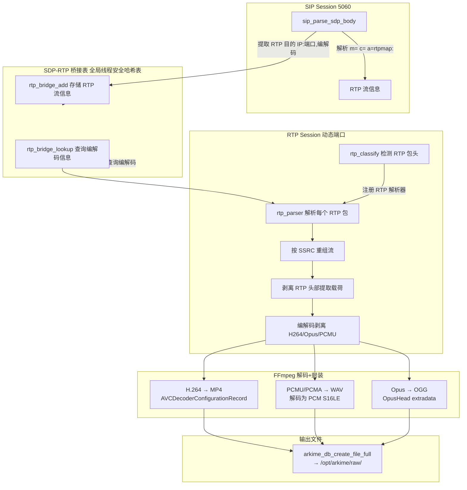

# SIP RTP 内容提取与音视频还原方案

## 1. 概述

在现有 SIP 解析器（已实现 SDP → RTP 流识别）的基础上，扩展实现对 RTP 媒体流的抓包还原：
- 解析 RTP 数据包头部（RFC 3550）
- 按 SSRC 重组 RTP 流
- H.264 解包（FU-A / STAP-A / Single NAL, RFC 3984）
- 音频帧提取（PCMU / PCMA / G722 / Opus）
- **FFmpeg 解码+容器封装**：H.264 → MP4, PCMU/PCMA → WAV, Opus → OGG
- 通过 `arkime_db_create_file_full()` 保存到 Arkime 文件系统
- 添加 RTP 会话字段和标签

## 2. 架构图



## 3. 文件清单

| 文件 | 操作 | 说明 |
|------|------|------|
| `capture/parsers/rtp.c` | **新建** | RTP 解析器主文件 (~1320行) |
| `capture/parsers/rtp.h` | **新建** | RTP 公共定义和桥接表 API (~149行) |
| `capture/parsers/sip.c` | **修改** | 添加 `#include "rtp.h"` 和桥接表注册 |
| `capture/parsers/Makefile` | **修改** | 添加 `rtp.so` 规则 + `$(FFMPEG_LIBS)` 链接 |
| `capture/parsers/rtp.detail.jade` | **新建** | RTP 详情模板 |
| `plans/sip-rtp-content-extraction-plan.md` | **修改** | 本文档，更新为 FFmpeg 集成方案 |

## 4. 核心组件设计

### 4.1 SDP-RTP 桥接表 rtp.h

```c
// RTP 流信息，由 SIP 解析器填充，RTP 解析器查询
typedef struct {
    char     mediaType[16];    // "audio" "video"
    char     codec[32];        // "PCMU" "H264" "OPUS"
    int      payloadType;      // 动态 PT 编号
    uint32_t ssrc;             // 0=未知，RTP 解析后填充
    char     sipSessionId[64]; // 关联的 SIP 会话 ID
} RtpBridgeInfo_t;

// 桥接表操作（线程安全）
void rtp_bridge_add(const char *ip, uint16_t port, RtpBridgeInfo_t *info);
int  rtp_bridge_lookup(const char *ip, uint16_t port, RtpBridgeInfo_t *info);
void rtp_bridge_remove(const char *ip, uint16_t port);
void rtp_bridge_init(void);
void rtp_bridge_exit(void);
```

**实现细节：**
- 使用 `GHashTable` + `GMutex` 实现线程安全
- Key：`{ip:port}` 字符串 (e.g., "192.168.1.2:10000")
- Value：`RtpBridgeInfo_t` (malloc'd, free'd on remove)
- SIP 解析器在 `sdp_parse_media()` 末尾调用 `rtp_bridge_add()`
- RTP 解析器在首次收到包时调用 `rtp_bridge_lookup()`

### 4.2 RTP 数据包解析 rtp.c

**RTP 头部格式 (RFC 3550)：**
```
 0                   1                   2                   3
 0 1 2 3 4 5 6 7 8 9 0 1 2 3 4 5 6 7 8 9 0 1 2 3 4 5 6 7 8 9 0 1
+-+-+-+-+-+-+-+-+-+-+-+-+-+-+-+-+-+-+-+-+-+-+-+-+-+-+-+-+-+-+-+-+
|V=2|P|X|  CC   |M|     PT      |       sequence number         |
+-+-+-+-+-+-+-+-+-+-+-+-+-+-+-+-+-+-+-+-+-+-+-+-+-+-+-+-+-+-+-+-+
|                           timestamp                           |
+-+-+-+-+-+-+-+-+-+-+-+-+-+-+-+-+-+-+-+-+-+-+-+-+-+-+-+-+-+-+-+-+
|                           SSRC                                |
+-+-+-+-+-+-+-+-+-+-+-+-+-+-+-+-+-+-+-+-+-+-+-+-+-+-+-+-+-+-+-+-+
|                   CSRC 列表 (可选, CC 指示个数)                |
+-+-+-+-+-+-+-+-+-+-+-+-+-+-+-+-+-+-+-+-+-+-+-+-+-+-+-+-+-+-+-+-+
|                   扩展头部 (可选, X=1)                          |
+-+-+-+-+-+-+-+-+-+-+-+-+-+-+-+-+-+-+-+-+-+-+-+-+-+-+-+-+-+-+-+-+
|                        载荷数据 ...                            |
+-+-+-+-+-+-+-+-+-+-+-+-+-+-+-+-+-+-+-+-+-+-+-+-+-+-+-+-+-+-+-+-+
```

```c
// RTP 包头解析宏
#define RTP_VER(data)         (((data)[0] >> 6) & 0x03)
#define RTP_PADDING(data)     ((data[0] >> 5) & 0x01)
#define RTP_EXTENSION(data)   ((data[0] >> 4) & 0x01)
#define RTP_CC(data)          (data[0] & 0x0F)
#define RTP_MARKER(data)      ((data[1] >> 7) & 0x01)
#define RTP_PT(data)          (data[1] & 0x7F)
#define RTP_SEQ(data)         ((data[2] << 8) | data[3])
#define RTP_TS(data)          ((data[4] << 24) | (data[5] << 16) | (data[6] << 8) | data[7])
#define RTP_SSRC(data)        ((data[8] << 24) | (data[9] << 16) | (data[10] << 8) | data[11])
#define RTP_HEADER_LEN(cc, ext_len) (12 + (cc)*4 + (ext_len)*4)
```

### 4.3 RTP 流重组

每个 RTP 会话（5-tuple）可包含多个 SSRC 流。需要按 SSRC 维护重组状态：

```c
#define MAX_SSRC_PER_SESSION 4
#define MAX_RTP_PAYLOAD_SIZE 65536
#define MAX_STREAM_BUFFER_SIZE (50 * 1024 * 1024)  // 50MB 上限

typedef struct {
    uint32_t ssrc;              // SSRC 标识
    int      payloadType;       // RTP 载荷类型
    uint16_t lastSeq;           // 上次序列号，用于检测丢包
    int      packetCount;       // 收到的包数
    int      lostCount;         // 检测到的丢包数
    int      gotFirst;          // 是否收到第一个包
    int      bufOverflow;       // 缓冲溢出标记
    uint32_t firstTimestamp;    // 首个 RTP 时间戳
    uint32_t lastTimestamp;     // 最后 RTP 时间戳
    int      hasTimestamps;
    uint8_t *buf;               // 累积的载荷数据（Annex B / 音频帧）
    int      bufLen;            // 当前数据长度
    int      bufAlloc;          // 分配大小
    int      clockRate;         // RTP 时钟频率
    char     codec[32];         // 实际编解码名称
    int      hasSps;            // H.264 SPS 缓存
    uint8_t  sps[64];           // SPS NAL 单元
    int      spsLen;
    int      hasPps;            // H.264 PPS 缓存
    uint8_t  pps[64];           // PPS NAL 单元
    int      ppsLen;
} RtpStreamState_t;

typedef struct {
    RtpStreamState_t streams[MAX_SSRC_PER_SESSION];
    int              streamCount;
    RtpBridgeInfo_t  codecInfo;   // 从桥接表查询的编解码信息
    int              hasCodecInfo; // 是否已查询到编解码信息
    char             sessionId[64]; // 会话 ID "IP:port"
} RtpSessionData_t;
```

### 4.4 编解码载荷剥离与 FFmpeg 容器封装

不同编码格式的 RTP 载荷格式不同，需要针对性处理。使用 FFmpeg libavformat/libavcodec 进行解码和容器封装：

| 编码 | PT (静态) | 载荷格式 | **FFmpeg 输出格式** | FFmpeg 编码器 |
|------|-----------|---------|-------------------|--------------|
| PCMU | 0 | 每帧 160 字节 (20ms @ 8kHz) | **WAV (PCM S16LE)** | `avcodec_find_decoder(AV_CODEC_ID_PCM_MULAW)` → PCM |
| PCMA | 8 | 同上 | **WAV (PCM S16LE)** | `avcodec_find_decoder(AV_CODEC_ID_PCM_ALAW)` → PCM |
| G722 | 9 | 每帧 160 字节 | **WAV (PCM S16LE)** | `avcodec_find_decoder(AV_CODEC_ID_ADPCM_G722)` → PCM |
| G729 | 18 | 每帧 10 字节 | 暂不支持 | 专利限制 |
| H264 | 动态 96-127 | STAP-A/FU-A/Single NAL | **MP4 (codec copy)** | `AV_CODEC_ID_H264`, extradata = AVCDecoderConfigurationRecord |
| OPUS | 动态 96-127 | 单帧或多帧 | **OGG (codec copy)** | OpusHead extradata, 960 bytes/packet |
| VP8 | 动态 96-127 | 单帧 | **IVF (codec copy)** | `AV_CODEC_ID_VP8` |

#### H.264 解包 (RFC 3984)

- **Single NAL Unit** (NAL 类型 1-23)：加 `0x00 0x00 0x00 0x01` 起始码后追加到流缓冲区
- **STAP-A** (NAL 类型 24)：拆分多个 NAL 单元，每单元前加起始码
- **FU-A** (NAL 类型 28)：重组分片，从 FU indicator 的 NRI + FU header 的 Type 重建 NAL 头

SPS (NAL 类型 7) 和 PPS (NAL 类型 8) 被提取并缓存到 `RtpStreamState_t.sps/pps`，用于构建 MP4 的 `AVCDecoderConfigurationRecord`。

#### FFmpeg H.264 → MP4 封装

1. `avformat_alloc_output_context2(&fmt_ctx, NULL, NULL, path)` → 自动检测 MP4
2. `avformat_new_stream(fmt_ctx, NULL)` → 创建 H.264 视频流
3. 构建 `AVCDecoderConfigurationRecord` extradata：
   - version=1, profile=spd[1], compatibility=spd[2], level=spd[3]
   - SPS count + SPS NAL 长度
   - PPS count + PPS NAL 长度
4. `avformat_write_header()` → 写入 MP4 容器头 (ftyp + moov)
5. 按帧写入：解析 Annex B 起始码，`av_interleaved_write_frame()`
6. `av_write_trailer()` → 写入 moov 索引

#### FFmpeg PCMU/PCMA → WAV 解码封装

1. `avcodec_find_decoder(AV_CODEC_ID_PCM_MULAW/ALAW)` → 解码器
2. `avcodec_open2(dec_ctx, decoder, NULL)` → 初始化解码器
3. `avformat_alloc_output_context2(&fmt_ctx, NULL, "wav", path)` → WAV 输出
4. 逐帧解码：`avcodec_send_packet()` → `avcodec_receive_frame()` → 转 PCM S16LE
5. `av_interleaved_write_frame()` → 写入 PCM 数据到 WAV

#### FFmpeg Opus → OGG 封装

1. `avformat_alloc_output_context2(&fmt_ctx, NULL, "ogg", path)` → OGG 输出
2. 构建 OpusHead extradata (19 字节)：magic "OpusHead", version=1, channels, preskip, sample_rate=48000, gain
3. `avformat_write_header()` → 写入 OGG 容器头
4. 按包写入 Opus 帧 (960 bytes/packet @ 48kHz) → `av_interleaved_write_frame()`
5. `av_write_trailer()`

### 4.5 文件保存

在 `rtp_save()`（parserSaveFunc）中执行：
- 为每个 SSRC 流调用对应的 FFmpeg muxer 函数
- 通过 `arkime_db_create_file_full()` 获取 Arkime 管理的文件路径
- 文件名格式：`rtp_{ssrc}_{codec}.{ext}`

```c
// 容器扩展名映射（FFmpeg 输出格式）
const char *rtp_codec_container_ext(const char *codec) {
    if (g_ascii_strcasecmp(codec, "H264") == 0) return "mp4";
    if (g_ascii_strcasecmp(codec, "PCMU") == 0) return "wav";
    if (g_ascii_strcasecmp(codec, "PCMA") == 0) return "wav";
    if (g_ascii_strcasecmp(codec, "OPUS") == 0) return "ogg";
    if (g_ascii_strcasecmp(codec, "G722") == 0) return "wav";
    if (g_ascii_strcasecmp(codec, "VP8")  == 0) return "ivf";
    return "raw";
}
```

FFmpeg muxer 函数签名：
```c
// H.264 → MP4 (codec copy, SPS/PPS extradata)
int rtp_mux_h264_to_mp4(const char *output_path,
                         const uint8_t *annex_b_data, int annex_b_len,
                         uint32_t first_ts, uint32_t last_ts, int clock_rate,
                         const uint8_t *sps, int sps_len,
                         const uint8_t *pps, int pps_len);

// PCMU/PCMA → WAV (true decode: μ-law/A-law → PCM S16LE)
int rtp_mux_audio_to_wav(const char *output_path, const char *codec_name,
                          const uint8_t *audio_data, int audio_len,
                          uint32_t first_ts, uint32_t last_ts, int clock_rate);

// Opus → OGG (codec copy with OpusHead extradata)
int rtp_mux_opus_to_ogg(const char *output_path,
                         const uint8_t *opus_data, int opus_len,
                         uint32_t first_ts, uint32_t last_ts, int clock_rate);
```

## 5. SIP 解析器修改

在 [`sip.c`](capture/parsers/sip.c) 的 `sdp_parse_media()` 函数末尾，添加桥接表注册：

```c
// sdp_parse_media 末尾添加
RtpBridgeInfo_t bridgeInfo;
memset(&bridgeInfo, 0, sizeof(bridgeInfo));
memcpy(bridgeInfo.mediaType, mediaBuf, mediaLen);
bridgeInfo.mediaType[mediaLen] = '\0';
// codecName 已在 sdp_parse_media 中解析
g_strlcpy(bridgeInfo.codec, codecName, sizeof(bridgeInfo.codec));
bridgeInfo.payloadType = pt; // 当前处理的 PT
rtp_bridge_add(connectionIp, port, &bridgeInfo);
```

在 `sip.c` 顶部添加：
```c
#include "rtp.h"
```

## 6. RTP 会话分类器

**方法：** 使用 `arkime_parsers_classifier_register_udp()` 注册一个 RTP 分类函数。
由于 RTP 没有固定的魔数字节，采用以下策略：

1. 注册匹配 NULL（匹配所有 UDP 包），在 classify 函数中检查：
   - 首字节高 2 位 == 2 (version 2)
   - PT 不在 64-95 范围（保留给 RTCP）
   - 载荷长度 >= 12 字节
   - 拒绝全零数据包

```c
void rtp_classify(ArkimeSession_t *session, const uint8_t *data, int len,
                  int UNUSED(which), void *UNUSED(uw))
{
    if (arkime_session_has_protocol(session, "rtp"))
        return;
    if (len < 12 || RTP_VER(data) != 2)
        return;
    int pt = RTP_PT(data);
    if (pt >= 64 && pt <= 95)
        return;
    if (data[0] == 0 && data[1] == 0)
        return;

    arkime_session_add_protocol(session, "rtp");
    arkime_session_add_tag(session, "rtp:stream");

    RtpSessionData_t *rtpData = ARKIME_TYPE_ALLOC0(RtpSessionData_t);
    // ... 初始化 sessionId ...
    arkime_parsers_register2(session, rtp_parser, rtpData, rtp_free, rtp_save);
}
```

## 7. RTP 解析器处理流程

```
rtp_parser() 每个 UDP 包调用
│
├─1. 检查 len >= 12, RTP version == 2
│
├─2. 解析 RTP 头部
│   ├─ payloadType, sequenceNumber, timestamp, ssrc
│   ├─ CC, extension bit, padding bit
│   └─ 计算头部总长 (12 + CC*4 + extension_len*4)
│
├─3. 查找/创建 SSRC 流
│   ├─ 遍历已存在的流，匹配 SSRC
│   ├─ 新 SSRC → 创建新流（最多 MAX_SSRC_PER_SESSION=4）
│   └─ 更新流状态
│
├─4. 检测丢包
│   ├─ 第一个包时记录 lastSeq = seq
│   ├─ 后续包：seq - lastSeq > 1 → lostCount += (seq - lastSeq - 1)
│   └─ lastSeq = seq
│
├─5. 首次包查询桥接表
│   ├─ 用 session->addr2:port2 查 SDP-RTP 桥接表
│   ├─ 如获取到 codecInfo → 设置 stream->codec/clockRate
│   └─ 如未获取到，用 src 方向再查一次
│
├─6. 提取载荷
│   ├─ 跳过 RTP 头部
│   ├─ 处理 padding
│   └─ 调用 depacketize 函数
│
├─7. 编解码剥离
│   ├─ H264 → rtp_depacket_h264() (FU-A/STAP-A/Single NAL → Annex B)
│   ├─ PCMU/PCMA/Opus → rtp_append_audio_frame() (直接拷贝)
│   └─ 其他 → 直接拷贝
│
├─8. 累积到流缓冲区
│   ├─ 检查大小上限 (MAX_STREAM_BUFFER_SIZE = 50MB)
│   └─ realloc + memcpy 追加
│
└─9. 写入会话字段
    ├─ rtp.ssrc, rtp.payload_type, rtp.codec, rtp.media
    ├─ rtp.packets++, rtp.lost 累加
    └─ 添加标签 rtp:{codec}, rtp:{media}
```

## 8. 字段定义

### 字段注册（arkime_parser_init 中）

| 字段名 | API | 类型 | 说明 |
|--------|-----|------|------|
| `rtp.ssrc` | `arkime_field_define` | termfield | RTP 同步源标识符 |
| `rtp.payload_type` | `arkime_field_define` | termfield | RTP 载荷类型编号 |
| `rtp.codec` | `arkime_field_define` | termfield | 编解码名称 (H264/PCMU/OPUS) |
| `rtp.media` | `arkime_field_define` | termfield | 媒体类型 (audio/video) |
| `rtp.packets` | `arkime_field_int_add` | integer | 该会话收到的 RTP 包数 |
| `rtp.lost` | `arkime_field_int_add` | integer | 检测到的丢包数 |
| `rtp.streams` | `arkime_field_int_add` | integer | 该会话中的 SSRC 流数 |
| `rtp.files` | `arkime_field_string_add` | termfield | 保存的文件路径列表 |

### 会话标签

- `rtp:stream` — 标识为 RTP 流会话
- `rtp:{codec}` — 具体编码 (rtp:h264, rtp:opus)
- `rtp:{media}` — 媒体类型 (rtp:audio, rtp:video)

## 9. rtp.detail.jade 模板

```jade
if (session.rtp)
  div.sessionDetailMeta.bold RTP
  dl.sessionDetailMeta
    +arrayList(session.rtp, 'media', 'Media', 'rtp.media')
    +arrayList(session.rtp, 'codec', 'Codec', 'rtp.codec')
    +arrayList(session.rtp, 'ssrc', 'SSRC', 'rtp.ssrc')
    +arrayList(session.rtp, 'payload_type', 'PT', 'rtp.payload_type')
    +arrayList(session.rtp, 'packets', 'Packets', 'rtp.packets')
    +arrayList(session.rtp, 'lost', 'Lost', 'rtp.lost')
    +arrayList(session.rtp, 'files', 'Files', 'rtp.files')
```

## 10. 构建配置

由于 `rtp.so` 需要链接 FFmpeg 库，不能使用 Makefile 的通用 `%so : %.c` 规则，需要使用独立规则：

```makefile
# FFmpeg 依赖探测
FFMPEG_LIBS := $(shell pkg-config --libs libavformat libavcodec libavutil libswresample 2>/dev/null || echo "-lavformat -lavcodec -lavutil -lswresample")
FFMPEG_CFLAGS := $(shell pkg-config --cflags libavformat libavcodec libavutil libswresample 2>/dev/null || echo "")

# rtp.so 独立编译规则（需要 FFmpeg 链接）
rtp.so: rtp.c ../arkime.h ../hash.h ../dll.h ../bsb.h
	$(CC) -pthread --shared $(EXTRA_CFLAGS) $(FFMPEG_CFLAGS) \
	  -o $@ -g -O2 -Wall -Wextra -D_GNU_SOURCE -std=gnu99 \
	  -fno-strict-aliasing -g -fPIC \
	  $(INCLUDE_PCAP) $(INCLUDE_OTHER) $< $(FFMPEG_LIBS)
```

FFmpeg 版本要求：
- libavformat >= 58 (Ubuntu 22.04+)
- libavcodec >= 58
- libavutil >= 56
- libswresample >= 3

开发库安装：
```bash
apt-get install -y libavformat-dev libavcodec-dev libavutil-dev libswresample-dev
```

## 11. 实现步骤

| 步骤 | 文件 | 描述 | 状态 |
|------|------|------|------|
| 1 | `rtp.h` | 新建 — 桥接表定义+API，RTP 常量，H.264 宏，FFmpeg 辅助声明 | ✅ 完成 |
| 2 | `rtp.c` | 新建 — RTP 解析器完整实现（含 FFmpeg 解码/封装） | ✅ 完成 |
| 3 | `sip.c` | 修改 — 添加 `#include "rtp.h"` 和桥接表注册 | ✅ 完成 |
| 4 | `Makefile` | 修改 — 添加 `rtp.so` 独立编译规则 + FFmpeg 链接 | ✅ 完成 |
| 5 | `rtp.detail.jade` | 新建 — RTP 详情模板 | ✅ 完成 |
| 6 | 编译测试 | 验证 `make rtp.so` 和 `make sip.so` 通过，零警告 | ✅ 完成 |

## 12. 局限性

1. **无 RTCP 支持：** 不解析 RTCP 包（SR/RR/SDES/BYE），无法获取 QoS 统计和 CNAME 关联。
2. **G.729 不支持：** 因 FFmpeg 专利限制，G.729 解码不可用。
3. **Opus 帧边界检测：** Opus RTP 载荷格式支持多帧，当前简化处理为单帧/包。
4. **H.264 PTS 使用近似值：** 首帧 PTS=0，后续帧按 1/clock_rate 递增。
5. **单方向保存：** 每个 RTP 会话仅保存一个方向的数据；双向通话会产生两个独立会话。
6. **缓冲区上限：** 每流 50MB 上限，超出部分丢失。

## 13. 未来优化方向

1. **RTCP 支持：** 解析 RTCP 包获取统计信息、CNAME、丢包率
2. **SIP-RTP 关联显示：** 在 SIP 详情页显示关联的 RTP 会话链接
3. **DTMF 检测：** 识别 RFC 2833/4733 DTMF 事件
4. **T.38 传真支持：** 检测并提取 T.38 传真数据
5. **双向 RTP 合并：** 将两个方向的 RTP 流关联到同一个通话记录
6. **H.265/VP9 支持：** 扩展 FFmpeg 编码器映射
