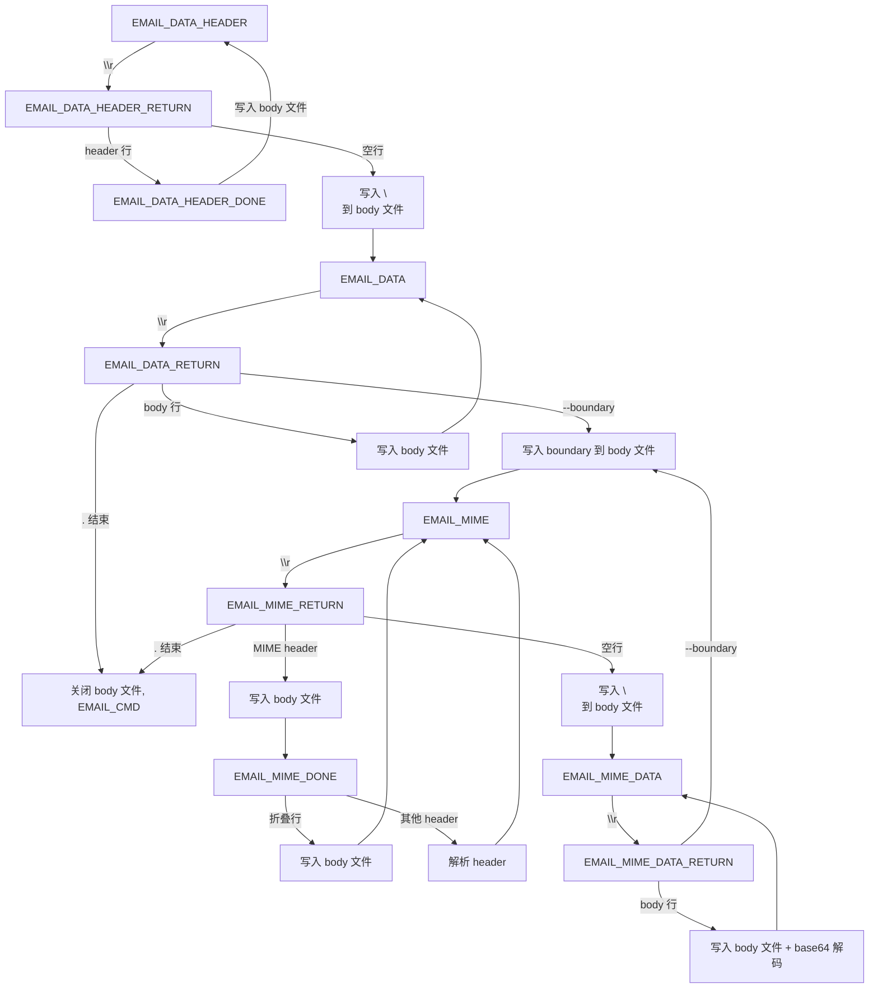

# SMTP 邮件还原修复计划 v2 - MIME 邮件正文和附件丢失问题

## 问题描述

还原的 `.eml` 文件只包含邮件头部信息（约 1KB），没有正文和附件内容。

## 根因分析

SMTP 解析器在 `EMAIL_DATA_RETURN` 状态中，当检测到 MIME boundary 行（如 `--boundary`）时，会**关闭 body 文件**（[`capture/parsers/smtp.c:847-860`](../capture/parsers/smtp.c:847)），并将状态切换到 `EMAIL_MIME`。后续的 MIME 子部分内容在 `EMAIL_MIME_DATA_RETURN` 状态中只处理 base64 解码，**不写入 body 文件**。

## 修复方案

将所有邮件内容（包括 MIME boundary 行、MIME 子部分 header、MIME 子部分 body）都写入同一个 `.eml` 文件，直到遇到邮件结束标记 `"."`。

### 修改 1: `EMAIL_DATA_RETURN` - MIME boundary 处理

**文件**: [`capture/parsers/smtp.c:847-878`](../capture/parsers/smtp.c:847)

当前行为：遇到 MIME boundary 时关闭 body 文件。

修改为：将 MIME boundary 行写入 body 文件，**不关闭** body 文件。

```c
if (found) {
    /* MIME boundary found - write boundary line to body file, don't close it */
    if (config.httpBodySave && email->bodyFile) {
        fwrite(line->str, 1, line->len, email->bodyFile);
        fwrite("\n", 1, 1, email->bodyFile);
    }
    // ... 保留原有的 base64/magic 处理 ...
    *state = EMAIL_MIME;
}
```

### 修改 2: `EMAIL_MIME_RETURN` - 写入 MIME header 行到 body 文件

**文件**: [`capture/parsers/smtp.c:998-1013`](../capture/parsers/smtp.c:998)

当前行为：只处理状态转换，不写入 body 文件。

修改为：将 MIME 子部分的 header 行写入 body 文件。

```c
case EMAIL_MIME_RETURN: {
    if (*line->str == 0) {
        /* Empty line = end of MIME headers, write to body file */
        if (config.httpBodySave && email->bodyFile) {
            fwrite("\n", 1, 1, email->bodyFile);
        }
        *state = EMAIL_MIME_DATA;
    } else if (strcmp(line->str, ".") == 0) {
        /* End of email - close body file */
        if (email->bodyFile) {
            fclose(email->bodyFile);
            email->bodyFile = NULL;
            // store checksums
        }
        email->needStatus[which] = 1;
        *state = EMAIL_CMD;
    } else {
        /* MIME header line - write to body file */
        if (config.httpBodySave && email->bodyFile) {
            fwrite(line->str, 1, line->len, email->bodyFile);
            fwrite("\n", 1, 1, email->bodyFile);
        }
        *state = EMAIL_MIME_DONE;
    }
    ...
}
```

### 修改 3: `EMAIL_MIME_DONE` - 写入折叠行到 body 文件

**文件**: [`capture/parsers/smtp.c:1015-1053`](../capture/parsers/smtp.c:1015)

当前行为：折叠行处理时不写入 body 文件。

修改为：将 MIME header 的折叠行写入 body 文件。

```c
if (*data == ' ' || *data == '\t') {
    /* Folded MIME header line - write to body file */
    if (config.httpBodySave && email->bodyFile) {
        fwrite(" ", 1, 1, email->bodyFile);
    }
    g_string_append_c(line, *data);
    break;
}
```

### 修改 4: `EMAIL_MIME_DATA_RETURN` - 写入 MIME body 行到 body 文件

**文件**: [`capture/parsers/smtp.c:879-898`](../capture/parsers/smtp.c:879)

当前行为：只处理 base64 解码，不写入 body 文件。

修改为：将 MIME 子部分的 body 行（包括 base64 编码的附件内容）写入 body 文件。

```c
} else if (*state == EMAIL_MIME_DATA_RETURN) {
    /* Write MIME body line to body file */
    if (config.httpBodySave && email->bodyFile && line->len > 0) {
        fwrite(line->str, 1, line->len, email->bodyFile);
        fwrite("\n", 1, 1, email->bodyFile);
    }
    
    if (email->base64Decode & (1 << which)) {
        // ... 保留原有的 base64 解码处理 ...
    }
    *state = EMAIL_MIME_DATA;
}
```

## 状态机流程图



## 验证方法

1. 编译：`make -j$(nproc)` 确认无错误
2. 使用包含附件的 SMTP 流量测试，检查生成的 `.eml` 文件是否包含完整的邮件内容
3. 使用 `file` 命令检查 `.eml` 文件类型
4. 使用文本编辑器打开 `.eml` 文件确认包含 header + body + 附件
